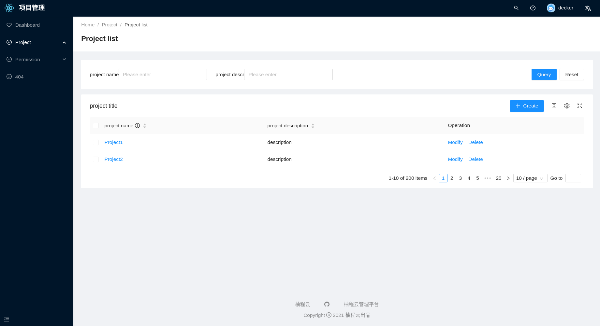

# New technology stack management system

The background management system of the new technology stack

- React
- Recoil
- React Query
- React Hooks
- Vite
- Typescript

## [Document](./README.md)

## screenshot




## Install and use

- get project code

```
 git clone https://github.com/ychengcloud/react-vite-admin.git
```

- Install dependencies

```
 cd react-vite-admin
```

```
 yarn install
```

```
 yarn dev
```

```
 yarn build
```

- [Antd Design](https://ant.design)
- [Antd Design Pro](https://pro.ant.design/)
- [Vite](https://vitejs.dev/)
- [React Query](https://react-query.tanstack.com/)
- [React antd admin](https://github.com/WinmezzZ/react-antd-admin.git)
- [vue-vben-admin](https://github.com/anncwb/vue-vben-admin)

## License

[MIT](./LICENSE)
